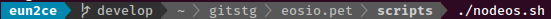
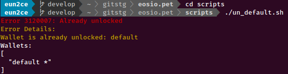
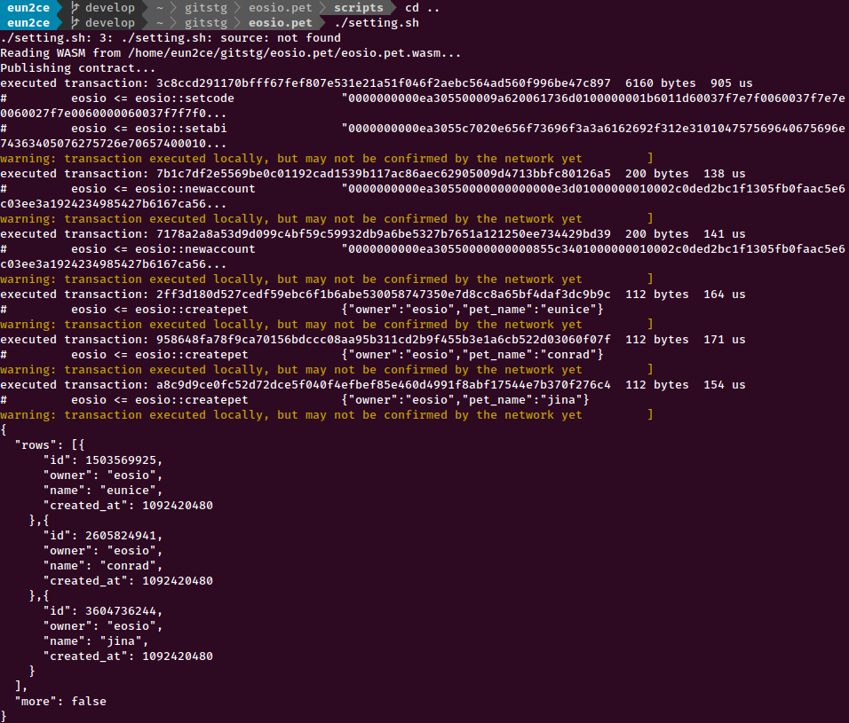
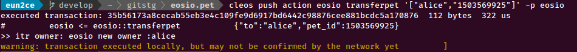
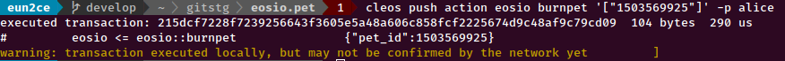

# eosio.pet

## intro
maybe ..  
i tried to implement an NFT token with eos

## enjoy
### step 1
build nodeos
```cmd
cd scripts
./nodeos.sh
```

### step 2
cleos wallet unlock
```cmd
cd scripts
./scripts/un_default.sh
```

### step 3
this file include create account, createpet action
```cmd
cd ../
./unitest.sh
```
### step 4
enjoy your self

## test
### build nodeos 


### wallet unlock


### set transaction and create accounts


### try transaction
* transfer pet

* burn pet

